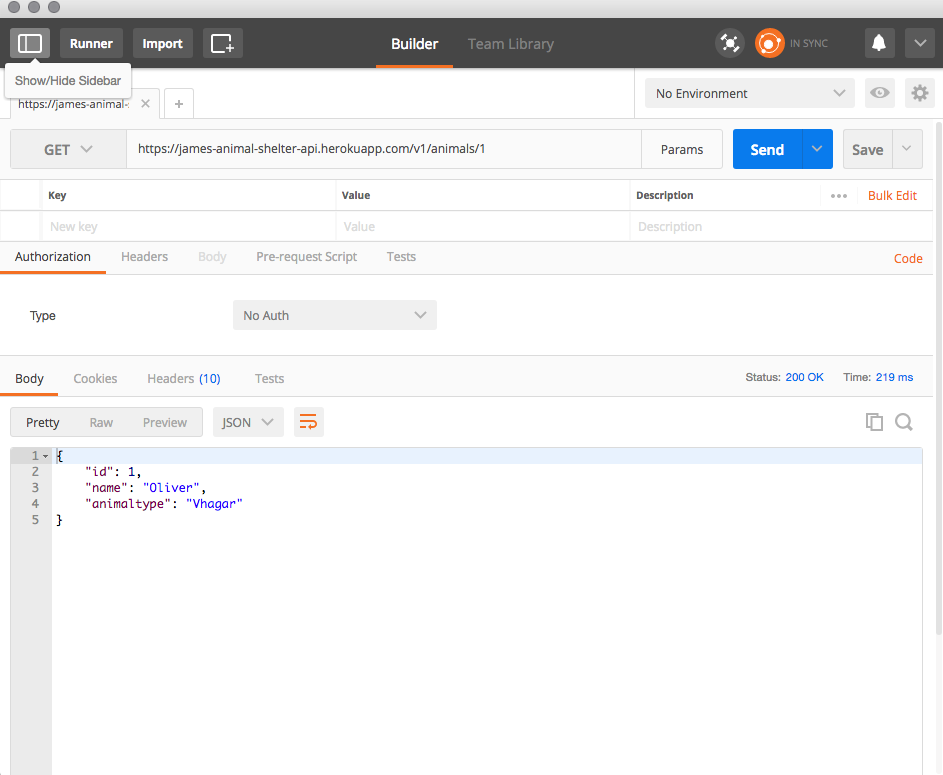

<h1 align="center">
James' API Practice
</h1>

#### _This is an API with FAKER data representing an Animal Shelter's available animals._

Visit Live Hosted Site On Heroku [here](https://james-animal-shelter-api.herokuapp.com/v1/animals)

#### By _**James Higgins**_

## How To Use
I recommend using the Google Chrome extension [Postman](https://chrome.google.com/webstore/detail/postman/fhbjgbiflinjbdggehcddcbncdddomop?hl=en) to view and play around with this API.

* _Ensure connection to the Internet_
* _On a mac using spotlight search, type in terminal_
* _Once in terminal enter the following commands to clone the file to your desktop and open the repository:_
```
$ cd desktop
$ git clone https://github.com/jamesmilanhiggins/Animal-Shelter-Api
$ cd Animal-Shelter-Api
$ bundle
$ rake db:setup
$ rails s
$ open localhost:3000 in your browser

```
 or view live site [here](https://james-animal-shelter-api.herokuapp.com/v1/animals)

## API Endpoints
  * View all animals ["/v1/animals"](https://james-animal-shelter-api.herokuapp.com/v1/animals)
  

  * View a specific animal ["/v1/animals/:id"](https://james-animal-shelter-api.herokuapp.com/v1/animals/1)
  

  * Add a new animal ["/v1/animals"](https://james-animal-shelter-api.herokuapp.com/v1/animals)
  

  * Edit an animal ["/v1/animals/:id"](https://james-animal-shelter-api.herokuapp.com/v1/animals/1)
  

  * Delete an animal ["/v1/animals/:id"](https://james-animal-shelter-api.herokuapp.com/v1/animals/1)
  


## Custom Endpoints
  * Search Animals by name
  [/v1/animals?name=Shadow](https://james-animal-shelter-api.herokuapp.com/v1/animals?name=Shadow)
  

  * View a random Animals
  [/v1/random](https://james-animal-shelter-api.herokuapp.com/v1/random)
  


## Versioning
  * This API is currently in Version 1.0.0 aka V1

## Known Bugs

 * There are no known bugs at this time


## Support and contact details

 _Please contact James Higgins at James.Milan.Higgins@gmail.com if you have any questions._

## Technologies Used

 * Ruby
 * Rails

### License

 *This software is licensed under MIT license.*

Copyright (c) 2017 **_James Higgins_**
